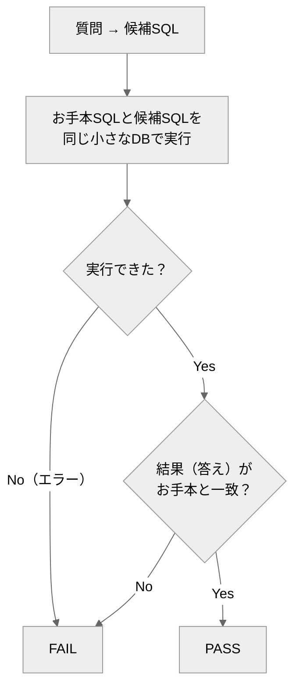

# text-to-sql-agent

*A tiny text-to-SQL agent for Japanese questions, scored by an execution oracle: candidate SQL runs on a small in-memory database and is judged by result equality, not string match.*
*Part of a series of self-built AI agents demonstrating evaluation-driven development.*

日本語の質問を **SQL に変換する**エージェントと、**書き方の違うSQLでも「実際に動かした結果」で正しさを判定する**オラクル（採点プログラム）。

専門用語を使わない説明は [説明書.md](説明書.md) にあります。

## 概要

SQL は同じ意味でも書き方が何通りもあり、文字列の一致では正しさを測れません。
このリポジトリは、正しさを **実際にデータベースで実行した結果**で確かめる **実行オラクル** の実例です。

お手本SQLと候補SQLを同じ小さなDBで動かし、結果（出てくる答え）が一致すれば正解。書式の違いには左右されません。

## クイックスタート

必要なもの：Python 3 のみ（sqlite3 は標準ライブラリ）。**リポジトリのルートで実行**。

```bash
python eval/oracle.py            # 正しいSQL集(reference)を採点 → PASS
python eval/oracle.py --selftest # オラクル自身を検証（②でFAILが出るのが正常）
```

→ ①は採点表に `PASS`、②は最後に `## オラクル判定: PASS`。どちらも終了コード 0（②で壊れた実装に FAIL が出るのは正常）。

## エージェントの動かし方

`.claude/agents/text-to-sql-agent.md` の指示で `eval/corpus/candidate.py`（`QUERIES = {質問ID: "SQL"}`）を実装し、`python eval/oracle.py --candidate candidate` で採点。オラクルは `eval/corpus/candidate.py` だけを読むため、他の場所（リポジトリ直下など）に置くと読み込めず FAIL になります。candidate が無くても `reference` で全工程を再現できます。

**実行の上限**：1つの SQL は SQLite の VM 命令 1,000,000 個までで打ち切ります（正例と妥当な別解は最大 144 命令）。停止条件の無い再帰 CTE など終わらない SQL は、構文エラーとは別に「実行予算超過」の FAIL になります。時間でなく命令数で数えるので、機械の速さで結果が変わりません。

## しくみ



## 合否（eval）
固定のDBで各SQLを実行し、全問の結果がお手本と一致すれば PASS。1問でも結果違い・実行エラーがあれば FAIL。

## 既知の限界（limitations）
- 結果の比較は「行タプルの文字列一致」です。列の並び順や値の型（整数か実数か等）が違うと、意味が同じでも FAIL になります。
- q4（最高給与の人）は、最高給与が同点で複数いるデータでは `LIMIT 1` 方式と `MAX` 副問い合わせ方式で結果が割れえます（現在のシードデータは同点なしのため成立）。
- オラクルは候補ファイルを Python として読み込んで実行します。信頼できる候補コードのみを採点対象にしてください。

## ファイル構成
- `.claude/agents/…md` … エージェント定義（Claude Code が認識する場所）／`eval/oracle.py` … 実行オラクル（`--selftest` 内蔵）
- `eval/corpus/reference.py` … 正例（お手本SQL）／`broken_*.py` … 既知バグ（陰性対照）
- `design/design.md` … 設計の考え方／`説明書.md` … 専門用語を使わない説明
- `.github/workflows/ci.yml` … CI（selftest を自動実行）

---
自作 AI エージェント集（評価駆動開発の実証）の一つ。背景は [design/design.md](design/design.md)。
